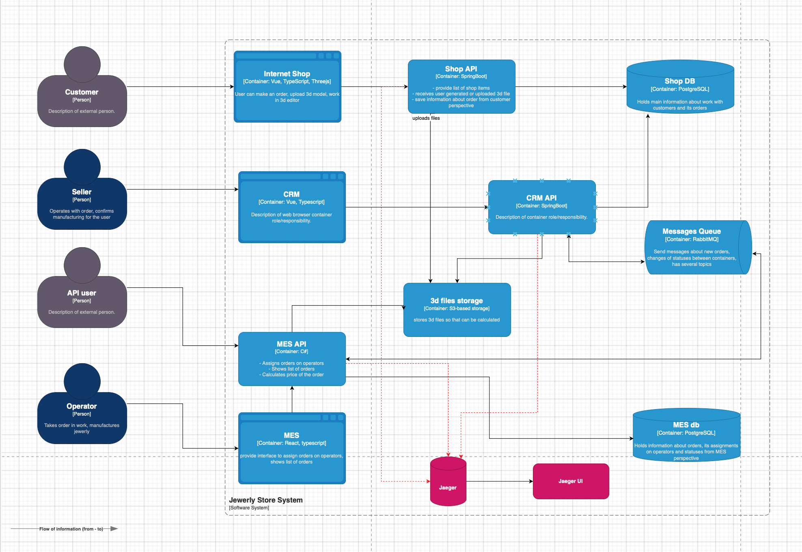

# Задание 3. Трейсинг

## Проанализируйте систему компании и C4-диаграмму в контексте планирования трейсинга
Согласно описанию процесса, заказ проходит через следующие системы:
- Онлайн-магазин
- CRM
- MES

Их мы и будем покрывать трейсингом.

**Описание процесса:**
- INITIATED [онлайн-магазин] — пользователь завёл новый заказ или положил товары в пустую корзину.
- FILE_UPLOADED [онлайн-магазин] — пользователь загрузил файл с 3D-моделью или создал его с помощью конструктора.
- SUBMITTED [онлайн-магазин] — пользователь нажал на кнопку «Сделать заказ». 
- PRICE_CALCULATED [MES] — система посчитала стоимость заказа. 
- MANUFACTURING_APPROVED [CRM] — заказ подтверждён, его можно отдавать в производство. 
- MANUFACTURING_STARTED [MES] — оператор взял заказ в работу. 
- MANUFACTURING_COMPLETED [MES] — оператор выполнил заказ. 
- PACKAGING [MES] — оператор начал упаковывать заказ. 
- SHIPPED [MES] — заказ отправлен покупателю. 
- CLOSED [CRM] — заказ завершён. Он закрывается после получения сообщения от транспортной компании или вручную.

## Мотивация
Получая тикет от пользователя, если ситуация не массовая, то в распределенной системе сложно разобраться в причине, многое может пойти не так.
Если у нас в продукте не настроен трейсинг, то скорее всего такой тикет будет закрыт, из-за сложности воспроизведения ситуации.
Трейсинг как раз позволяет решать такого рода тикеты и соответственно получать счастливых пользователей, которые могут привести
еще новых пользователей к нам в продукт. Еще есть вариант добавлять логи, но хранить логи стоит денег, в то время как трейсинг
намного дешевле и можно отследить всю цепочку вызовов, контекста и последовательностей. Дополнительно, трейсинг позволяет выявить места,
где запрос обрабатывался дольше всего и в дальнейшем оптимизировать эту часть сервиса. При дальнейшем расширение функционала
трейсинг просто необходим, чем больше мы будем добавлять сервисов тем сложно будет разбирать на каком этапе произошла ошибка.
В итоге, трейсинг позволяет быстро находить узкие места в распределенной системе, решать вопросы пользователей и позволяет
расширять архитектуру дополнительными сервисами без усложнения дебагинга.

## Добавьте раздел «Предлагаемое решение»
Трейсинг предлагаю внедрить при помощи инструмента Jaeger. Мы будем использовать Jaeger All-in-One, который из коробки поддерживает OpenTelemetry, нам остается
лишь поднять Jaeger и настроить свои сервисы чтобы они отправляли туда  данные о своей жизнидеятельности. У Jaeger уже 
имеется хранилиже, где он будет все эти данные хранить.

**Доработанная диаграмма.**

## Компромисы
В данном кейсе придется внедрять изменения в каждый сервис, что может быть достаточно затратно.
Особенно это касается купленного MES, есть 2 варианта, либо мы находим специалиста который
может нам помощь с внедрением, либо просим компанию, которая предоставила нам систему MES
доработать систему, чтобы отправлять нужный контекст в формате OpenTelemetry в Jaeger.

## Безопасность
Предлагаю внедрить 2 механизма безопасности. Первый, внедрить роли для сотрудников,
чтобы только авторизированные пользователи могли заходить в Jaeger UI и смотреть данные.
Вторую политику, это обфусцировать пользовательские данные и работать только с идентификаторами
запросов (trace_id, span_id). Добавить в тикет поля trace_id, space_id чтобы пользователи
добавиляли их каждый раз если у них произошла ошибка при использовании продукта.