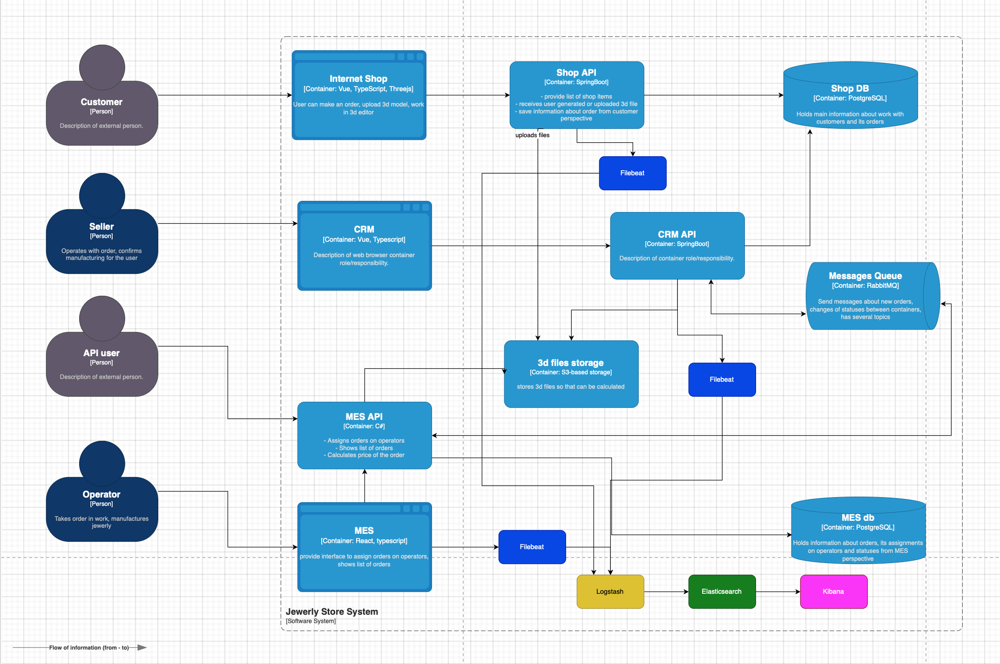

# Задание 4. Логирование

## Мотивация
Логирование является одним из компонентов обвервабилити и помогает при отладке разных компонентов системы.
Логирование предоставляет более детальное представление о системе и возможных ошибок. Еще логирование может использоваться
для бизнес-потребностей, к примеру, когда нужно выстроить определенную воронку для пользователей. В современнных системах
логирование и мониторинг работают в месте, частый случай когда мы получаем алерт из системы мониторинга, можно сразу
посмотреть в логах что именно пошло не так и быстрее устранить проблему.

В данном кейсе логирование стоит внедрять в начале в систему MES(API) и в магазин, чтобы понимать как пользователи
работают с системами. Так же это позволить лучше выявить узкие места, где именно мы тратим больше всего времени и понять
как лучше оптимизировать систему.

**Список инфо логов:**
1. Изменение заказа
2. Действия пользователя в онлайн-магазине
3. Просчет ювелирного изделия в MES
4. Действия продавща в CRM

## Предалагаемое решение
В данном кейсе предлагаю использовать логирование на уровне приложений и использовать стандартный стек ELK.
Компоненты логирования
1. Filebeat - агрегирует данные на клиенте и посылает их в LogStash 
2. Logstash - Собирает данные из всех сервисов и дальше отправляет в ElasticSearch
3. Elasticsearch - Сохраняет данные в NoSQL базе и строит индексы 
4. Kibana - используется для построения дэшов или визуализации логов
Решение 

### Политика безопасности
Предлагаю следующие политики
1. Ограничить доступ к чувствительным логам(можно использовать систему RBAC)
2. Добавить маску к персональным данным в логах, скрывать карты, тел. номер и персональные идентификаторы
3. Использовать шифрование логов во время тразита между filebeat и логсташем, можно еще добавить и при хранении, но это повлияет на скорость
4. Выставить правила про удаления логов. Обычно логи хранятся месяц, но логи нужные для безопасности могут храниться дольше

### Политика хранения
Как уже упомнилось выше, предлагаю хранения логов сроком на 1 месяц. Логи которые критичны или связаны с безопасностью можно хранить до 3 месяце или больше в зависимости от потребности бизнеса.
Размер логов, тоже зависит от кол-ва мест где мы хотим логировать. Так как хранение логов стоит денег, нужно будет утвердить с бизнесом сколько мы готовы тратить на хранения логов и дальше уже понимать какой должен быть размер логов
Я бы попробовал использовать отдельный индекс под систему, у нас разные ЯП и сервисы могут иметь специфичный формат

## Инциативы
С появлением логов и разных классификаций, стоит настроить алертинг. Первый вариант, это кол-во error и critical логов,
чтобы понимать, что с системой что-то идет не так. Дальше можно построить аналитику на инфо логов и смотреть базовое
значение для воронки и настроить алертинг если он меньше нужной нам границы. Можно смотреть общее кол-во логов в разбивке
по категории, чтобы понимать процент каждой категории логов. 