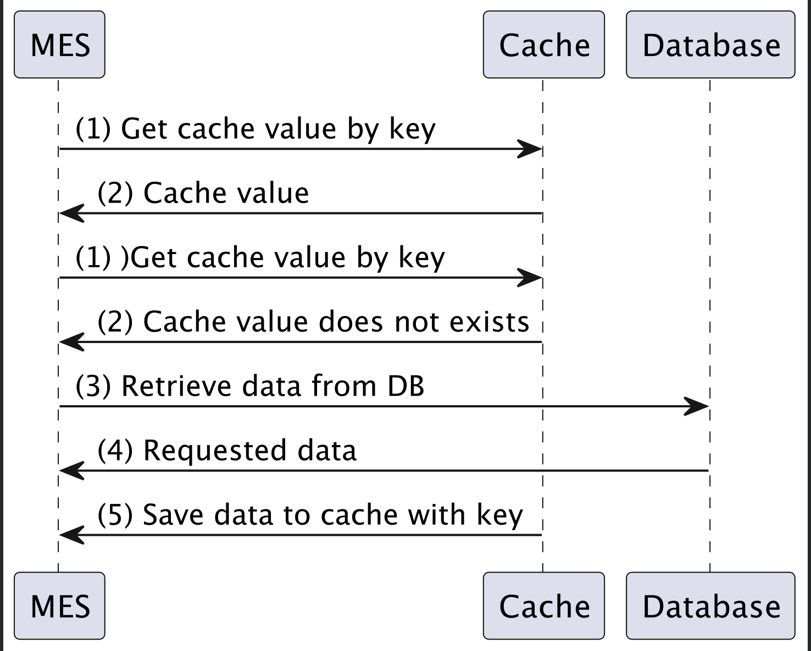
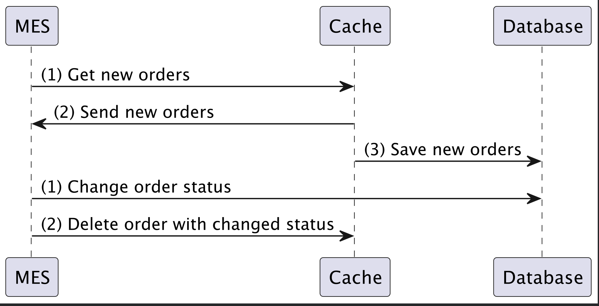

# Задание 5. Кеширование

## Проанализируйте диаграмму системы и её описание
Исходя из проблемы я предлагаю добавить кэш к 2 компонентам системы:
1. К просчитыванию стоимости издения(тут зависит от алгоритма просчета стоимости,
   но если он зависит от кол-ва полигона и размера изделия,
   то можно для каждого вендора записывать в кеш следующий ключ вендор + кол-во полигинов + размер)
2. К выдачи новых заказов

## Мотивация
В данном кейсе мотивация достаточно простая, у нас уже жалуются клиенты, что просчет заказа занимает много времени. С
другой стороны операторы жалуются на медленную скорость работы страницы. Чтобы не потерять

## Предлагаемое решение
Для кейса с просчитывания стоимости изделия, предлагаю внедрить серверный кеш со стратегией Cache Aside. Конечно тут
нужно иметь больше бизнес контекста, но кажется, что у производителя есть конечное кол-во изделий которое он может
произвести. Если учитывать, что стоимость считается исходя из кол-ва полигонов, веса и выбранного метала, то можно
попробовать записывать в кеш ключ вендор+кол-во полиготов+тип металла+вес. В таком случае повторые вычесления могут
браться из кеша. Инвадацию кеша можно производить когда изменится цена исходного материала, в остальных случаях
мы должны получить конечное кол-во изделий которое можно хранить в кеше. Повторюсь, тут сильно зависит от домена и бизнеса,
но как вариант, мне показалось что можно предложить.

Второе, это ускорить выдачу новых заказов. Разумеется нужно для начала определить узкое место, если это считывание с БД,
то проверить есть ли там индексы и какую нагрузку мы сейчас имеет. Возможно, добавление реплики на считывание ускорило
выдачу для новых товаров. Если есть проблема со статикой, то тут можно применить кеширование на клиенте. Используя заголов
Cache-Control. Но возможно, мы хотим сильно ускорить выдачу новых заказов и тем самым повысить скорость выполнения заказов, тогда
я предлагаю использовать паттерн Write-behind, то есть когда у заказа меняется статус мы добавляем его сначала в кеш для
выдачи операторам, чтобы они сразу увидели новые заказы, а после уже в асинхронном режиме обновляем БД. Остальные паттерны,
для даного кейса, не совсем подходят т.к. при первом чтение один из операторов будет ждать дольше и тогда у нас будет
не совсем честное распределение. Предлагаю хранить список заказов которые имеют нужный нам статус, как только статус у
заказа меняется на доставлен удалять заказ из кеша выдачи.

**Cache Aside**

**Write Behind**

**Инвалидация для просчета стоимости изделия**
Таблица не прижилась :(, отпишусь текстом.

Для данного кейса лучше подходит инвалидация на основе изменений. Мне кажется
что цена на сырье будет не так часто меняться и соответственно не нужно будет часто инвалидировать кеш. Другие варианты,
инвалидация по времени, не даст большого буста, т.к. нужно будет периодически долго ждать пока посчитается цена для нужного изделия, кажется не такой сильный импакт на производительность.
На основе програмных событий, тут тоже не совсем подходит

**Инвалидация для выдачи заказов**
Тут предлагаю попробовать програмнную инвалидацию. Как только статус заказа изменится, нужно будет удалить заказ из выдачи новых заказов. Времемная инвалидация в момент сброса
кеш будет обратно сильно тормозить систему. Инвалидация на основе изменений данных, в целом, для данного кейса тоже может подойти, но нам нужно изменять кеш только при определеном
смене статуса, а не при каждом. По ключу не подходит, т.к у нас по одному ключу хранится список всех заказов а не каждый отдельно.
